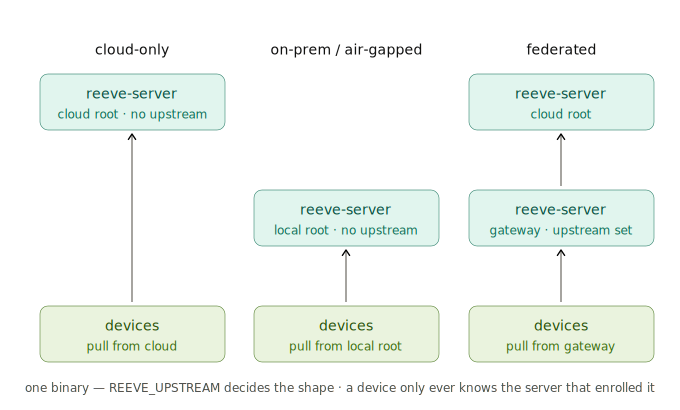

# reeve

**Fleet desired-state management for machines you don't get to visit.**

reeve manages workloads across fleets of edge boxes — factory floors,
retail sites, ships, anywhere Linux runs far from the people
responsible for it. You describe what the whole fleet should run in
one layered tree; reeve-server compiles that into an exact desired
state per device; reeve-agent on each box pulls it and makes it true.

reeve is [Margo](https://margo.org)-inspired: wire-compatible where it
counts (application packages, status reporting, capability manifests
parse and emit real Margo artifacts), and deliberately opinionated
where the spec is silent — offline behavior, state derivation,
durability, and distribution.

## The idea

Configuration is derived, never assembled by hand. Layers merge in a
fixed chain — **fleet → class → region → site → device** — where later
layers win, and the result is rendered by a pure function into a
per-device bundle: the compose file, config files, and Margo manifests
that ONE box should be running. Same inputs, byte-identical output.
There is no "drift" to reconcile between what you wrote and what a
device was told, because nobody ever edits a device's config directly
— you edit a layer, and every affected device's bundle re-renders.

Delivery is pull, and offline is the default assumption. Each agent
polls a tiny **State Manifest** (a version and a digest), pulls the
render bundle content-addressed when it changes, and converges with
plain `docker compose`. A box that's been dark for a month converges
from its last known state the whole time, then catches up in one poll
— and backfills its full status history with original timestamps, so
the fleet's history is forensic, not gap-filled.



Everything device-facing rides one socket: the UI, the API, live
status (SSE), the agent websocket (presence, nudges, terminal), and
content-addressed artifact pull (`/v2` — render bundles, app packages,
even the agent binary itself). One host, one port, one firewall rule.

## Topologies

Same binary at every tier. A server with no upstream is a root —
cloud-hosted or fully air-gapped, that's the same mode. Point it at an
upstream and it becomes a site gateway: it syncs the tree, renders
locally, and keeps its factory converging when the WAN is gone.
Air-gap transfer is signed archives on removable media, same formats.



## Built-in posture

- **Crash-only.** No shutdown ceremony anywhere. `kill -9` at any
  point leaves resumable state; startup IS recovery — for the server,
  the agent, installers, and uploads alike.
- **One database.** All server state, including full desired-state
  history (a content-addressed revision store — diff, undo, blame are
  queries), lives in SQLite. Durability is in-binary: encrypted
  snapshots plus seconds-RPO changeset streaming, with a
  restore-verify loop that continuously proves backups actually
  restore.
- **Secrets by reference.** Config carries `${secret:name}`; values
  never enter revisions, bundles, snapshots, or media. Agents resolve
  at apply time, per service, and rotations bounce exactly the
  containers that consume them.
- **Staged rollouts.** Changes propagate in waves over cohorts with
  health gates between them; a tripped failure threshold pauses the
  fleet in place. No automatic rollback — a paused, inspectable fleet
  beats a guessing one.
- **Every change is attributable.** Tree edits are authored revisions
  (the authoring API is IaC-friendly — keep your layers in your own
  git and apply from CI); remote terminal access is off by default,
  enabled only by an authored change, and always audited.

## Margo

reeve implements against a pinned snapshot of the Margo specification
(`spec/margo/`, submodule). Where reeve extends or replaces a Margo
surface, that's written down — additivity rules, the extension index,
and every touch on a Margo surface are in
[`spec/reeve/`](spec/reeve/00-INDEX.md); implementation decisions
in [`docs/decisions/`](docs/decisions/00-INDEX.md).

The upstream system design reeve implements against:


## Status

Pre-Milestone 1, spec-first: the documents above are the contract the
code is being built to. Milestone 1 is the full agent loop — manifest,
bundle, converge, report — against a local directory, no server.

## Building

```sh
git submodule update --init --recursive   # spec/margo + reference — required
cargo build --workspace
```
